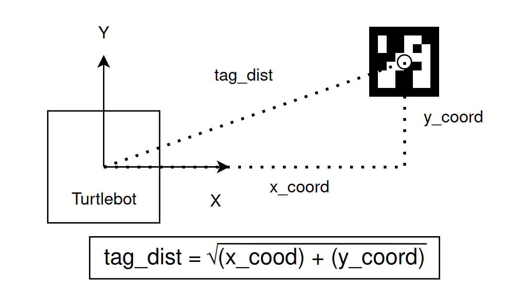
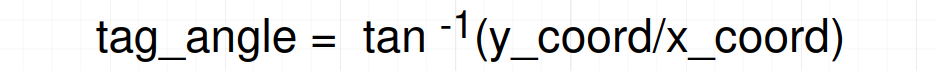
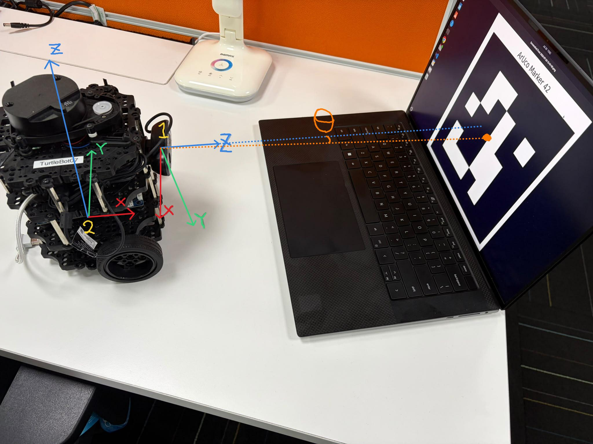

# ROS Industrial Consortium Asia Pacific ROS2 Basics Course Final Assessment


<br>


This portion covers the final assessment set-up steps for the ROS2 Basics course.

## Overall Objective: 

In this final assessment, you will be required to design and implement a ROS2 solution on a physical turtlebot3, which is requried to perform the following functions: 

### Level 1 Functionality

1. Upon detection of an aruco marker, the turtlebot should move straight towards the aruco marker. The turtlebot should remain stationary if it does not detect any Aruco markers


### Level 2 Functionality

2. When the robot reaches a predefined distance from the aruco marker, the robot should stop moving towards the marker.


### Level 3 Functionality

3. When the robot gets too close, beyond a predefined distance from the aruco marker, instead of stopping, the robot should start reversing.


### Level 4 Functionality
4. If the tag is not directly facing the turtlebot, the turtlebot should rotate to face the tag


## General Guidelines

The Assessment objective can be broken down into a few features

1. Aruco Marker Detection 
2. Turtlebot Teleoperation Functionality
3. Logic flow governing the rules for movement of the robot

Use the `final_assessment.py` file provided that has the code templates for you to fill in.

### Aruco Marker Detection

In Practical 8, you have already created a ROS2 Server that is able to output the pose of the Aruco Marker. Make use of this service server to aquire information about the pose of the marker.

### Turtlebot Teleoperation Functionality

In Pactical 3, you have created ROS2 publishers to move the Turtlebot. This should teach you the mechanism needed to move the turtlebot.

## Guiding Questions

1. The system needs to constantly check for an Aruco tag. How can we ensure that the system constantly checks for the tag?

2. The turtlebot's movement should be reactive based on the information of the location of the tag. How can we only trigger the motion of the robot everytime we detect a tag? This includes not just the distance from the tag, but the angle of the tag to the turtlebot as well.

3. To prevent the robot from going too fast, we might want to consider making the Turtlebot travel slower the closer it gets to the tag. How do we do this?

## Hints

### Getting distance of tag from turtlebot

The linear distance of the tag can simply be found using the Pythagoras theorem as shown in the image below


<br>

In python, it can be represented below

```python
    import math

    def get_tag_distance(self, x, y):
        return math.sqrt((x ** 2) + (y ** 2))
```

### Getting angle of tag from turtlebot

Similarly, the angle of the tag from the turtlebot can be found by using simple trigonometry


<br>

This can be represented in python below:

```python
    import numpy as np

    def get_tag_angle(self, x, y):
        return np.arctan(y/x)
```
### Note
Please note that:
1. The pose data we revcieve from the detection node will be in the camera_optical_frame (frame 1 in the picture below), so the x axis in the above pic will be z axis in the camera_optical_frame, and the y axis direction in the above pic will be negative x axis in the camera_optical_frame. 

    *Hint: To not have your theta be opposite, either you modify the x_pos data recieved, or you modify the theta computed. To line up with the clock-wise and anti-clockwise expression in note 2.*

2. The cmd_vel topic's data is based on the odom frame (frame 2 in the picture below), so when we say "Now I want the robot to turn towards the aruco marker." what we actually mean is "Now I want the robot to rotate around the z axis clockwise (negative angular vel) or anti-clockwise (positive angular vel) towards the aruco marker." 


<br>
camera_optical_frame: z = forward, x = right, y = down

odom_frame: z = up, x = forward, y = left

<!-- 
## Final Assessment 1.1 - Detecting AR Tag ID and Pose Information
Making reference the previous days Exercises 3 & 4, you are now required to write a new Service Client to capture the detected Aruco Marker Pose.

1. Collect an **ARUCO Marker** from the trainers.
2. Within the `final_assessment` package, make use of the script `aruco_tracker.py` , follow the instructions within the file to create a service client to capture the detected pose of the Aruco Marker.
3. Remember to add the entry points for your executables in your `setup.py`.

## Final Assessment 1.2 - Publishing Commands to the Turtlebot3
Making reference to the previous days Exercise 2, you are now required to publish commands to get the Turtlebot3 to move, in combination with the information gathered from the previous step 1.1.

1. Within the `final_assessment` package, make use of the script `teleop_aruco.py` and follow the instructions within the file to publish commands to move the turtlebot based on the pose information.

## Final Assessment 1.3 - Timer Callback to for Pose and Update Position of Turtlebot
1. Within the `final_assessment` package, include a `timer and callback` function in the  `aruco_tracker.py` script to constantly request for the pose of the marker and update the position of the turtlebot3.

## Final Assessment 1.4 - Writing a Launch File to Test your Answers
Making reference to the previous days Exercise 5, you are required to write a launch file to consolidate the multiple nodes to launch everything required for this final assessment.

1. Create a `launch` folder within the `final_assessment` package.
2. Create a launch file named `final_assessment.launch.py` that contains the multiple nodes required to launch everything.

## Verifying your Solution
Move the aruco marker back and forth as well as sideways and observe if the turtlebot moves towards it and faces in the same direction as it.

If the turtlebot3 behaves as intended, congratulations! You have now completed the final assessment for the ROS2 Basics course. -->

## Evaluation Criteria

The assessment objective can be evaluated based on the following components:

### 1. ArUco Marker Detection (20%)

- ArUco detection server is running correctly.
- Relevant pose topic is available and publishing data.
- Marker pose information can be verified through ROS 2 tools.
- System continuously checks for marker detections.

### 2. ArUco Pose Subscription (20%)

- Correct subscription to the ArUco pose topic.
- Marker pose data is received successfully.
- Latest pose information is stored and updated correctly.
- Data is available for use by robot control logic.

### 3. Distance and Angle Calculation (20%)

- Distance to the marker is calculated correctly.
- Relative angle to the marker is calculated correctly.
- Robot behaviour reacts to changes in marker position.
- Logic is implemented appropriately for the assessment objectives.

### 4. Turtlebot Movement Functionality (20%)

- Appropriate velocity commands are published.
- Robot moves towards the marker when detected.
- Robot slows down as it approaches the marker.
- Robot stops or reverses according to the defined distance thresholds.
- Robot rotates appropriately when alignment is required.

### 5. System Integration and Demonstration (20%)

- Successful integration of perception and robot control components.
- Robot exhibits the expected behaviour during testing.
- Required functionality levels are demonstrated successfully.

## Recommended Thresholds (starting points — tune to your robot & space)

These are guidelines; you may adjust them. Distances are in metres, measured
from the camera, so they depend on a correct `marker_size` and calibration.

- Stop distance (Level 2):     0.50 m  (stop once closer than this)
- Reverse distance (Level 3):  0.40 m  (reverse once closer than this)
- Angle allowance (Level 4):   0.10 rad (≈ 5.7°) before rotating to re-centre

Note: keep the reverse distance large enough that the marker stays in the
camera's view — if the robot gets too close, the camera may lose the marker.
